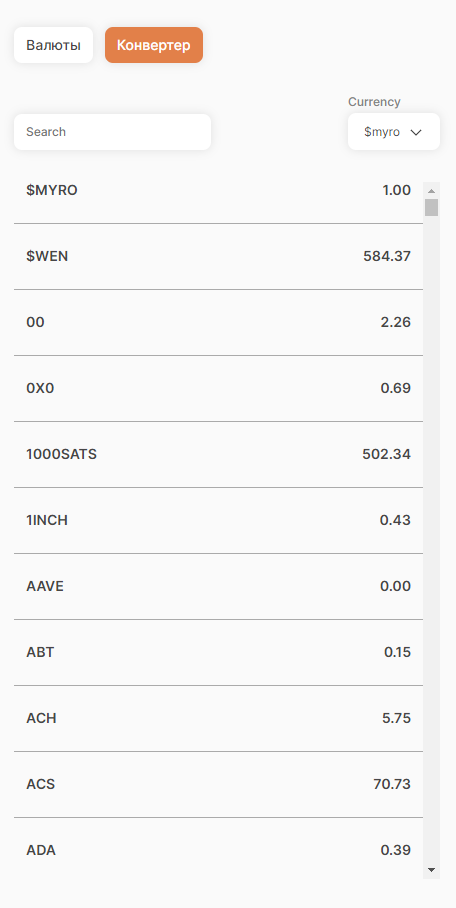
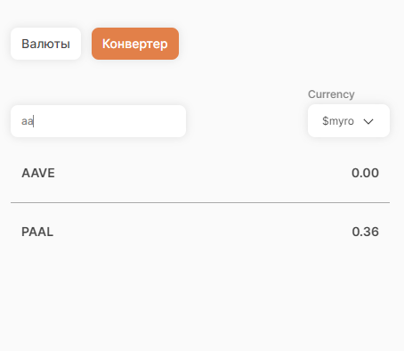
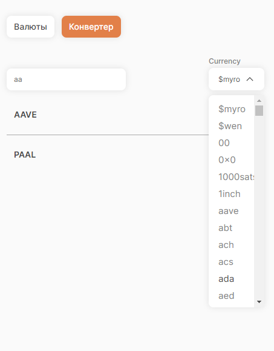
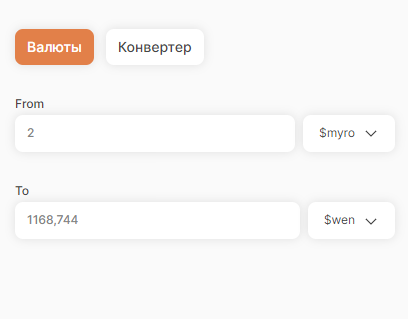

# Приложение для валюты

Приложение для конвертации валют, а так же просмотра курса. У приложение есть 2 страницы. на /converter пользователь
может просматривать актуальную стоимость разных валют к выбранной(соответственно и возможность ее менять присутствует),
искать по валютам, а так же переключиться на страницу /currencies.

Уже на странице /currencies оператор может переводить одну валюту в другую и обратно.

## В работе использовалось:

[VSCode](https://code.visualstudio.com/) + [Volar](https://marketplace.visualstudio.com/items?itemName=Vue.volar) (and
disable Vetur).
[Rest API](https://github.com/fawazahmed0/exchange-api?tab=readme-ov-file#readme).
[Sass](https://www.npmjs.com/package/sass). [Vuex](https://vuex.vuejs.org/guide). [Pretter](https://www.npmjs.com/package/prettier).
[Vite-svg-loader](https://www.npmjs.com/package/vite-svg-loader)
[axios](https://www.npmjs.com/package/axios).
[vue-router](https://router.vuejs.org/).

Дизайн
макет - [тут](https://www.figma.com/file/SoGANqCH9vu0J6Fmehyexr/%D0%A2%D0%B5%D1%81%D1%82%D0%BE%D0%B2%D0%BE%D0%B5-%D0%B7%D0%B0%D0%B4%D0%B0%D0%BD%D0%B8%D0%B5?type=design&node-id=0%3A1&mode=design&t=4CqbzhtRQUUWVbHs-1)

## Страница /converter

Основной экран. а данной странице пользователь может просматривать курс валют к выбранной валюте, менять выбранную
валюту, искать по курсу валют, а так же переключиться на другую страницу.


### Мобильная версия.



### Поиск по валюте.



### Выбор валюты.



## Страница /currencies

На этой странице пользователь может переводить из одной валюты в другую. Причем это работает в обе стороны. В более
простом варианте исполнения можно было бы задизаблить инпут to и тогда пересчет был бы проще. Я сделал вариант двойной
связи, так как считаю, что он более юзабельный.


### Мобильная версия.



## Установка проекта

```sh
npm install
```

### Запуск проекта в дев режиме

```sh
npm run dev
```

### Запуск проекта в билд

```sh
npm run build
```

### Автоматическое исправление от [ESLint](https://eslint.org/)

```sh
npm run lint
```
